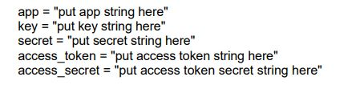

# RyanReynolds
A simple data analysis report performed by R 

## Table of Contents
1. [About the projects](#about-the-project)
2. [Technologies](#technologies)
3. [Features](#features)
5. [Setup](#setup)
6. [Contributing](#contributing)

## About the project
This project is a WSU Assignment that aims to create a simple data analysis report performed by R . This report will identify what the public associates with Ryan Reynolds in Twitter in terms of the language used in tweets, topics in the tweets, the relationship between followers and status count, and an outlook of his networks.

## Technologies
Project is created with:
* R

## Features

*More details can be found in the [report](./Report.pdf)*

#### Analysis of Twitter language about Ryan Reynolds
* Use search_tweets function from the rtweet library to search for 2000 tweets about Ryan
* Pre-process the collected data and construct a document-term matrix of the tweets by using TF-IDF weights
* Construct a word cloud of the word in document term matrix

#### Clustering the tweets
* Find the most appropriate number of clusters using the elbow method for the tweets by using cosine distance
* Cluster the tweets using k-means clustering
* Identify the number of tweets in each cluster. Identify which cluster is the largest
* Visualize the clustering in 2-dimensional vector space to present it. Show each cluster in a different colour
* Create the dendrograms of the words in the most populated two clusters

#### Who to follow
* Find the top 100 tweets that are retweeted the most in the collected tweets
* Identify the users of these tweets
* Get the follower count and the statuses count (number of tweets they posted) of these twitter handles
* Apply the appropriate statistical test to test the relationship between follower and statuses count

#### Building Networks
* Find the most popular 10 friends of Ryan Reynolds
* Obtain a 1.5-degree egocentric graph centred at the chosen Twitter handle and plot the graph. The egocentric graph should contain the most popular 10 friends of the chosen Twitter handle (eleven vertices)
* Compute the popularity of each vertex in your graph by using Page Rank method. List the top 3 most popular people in the graph according to the Page Rank scores

## Setup
#### Prerequisites
* R (http://cran.csiro.au/)
* RStudio (http://www.rstudio.com/ide/download/desktop)
* Twitter account
* Twitter Developer account (https://developer.twitter.com/en/apply-for-access)
* OAuth keys: follow the steps below to otain your keys
  * Log in your Twitter Developer account
  * Select *"Create a new application"*
  * When the application is created, it will be provided a consumer key, a consumer secret, an access token and an access token secret
  * Record the values and replace them in the R script when required
  
  

### Installation
* Open RStudio
* Select File > New Project > Version Control > Git
* Enter the link https://github.com/longta119/RyanReynolds in the URL

## Contributing

Contributions are what make the open source community such an amazing place to learn, inspire, and create. Any contributions you make are **greatly appreciated**.

If you have a suggestion that would make this better, please fork the repo and create a pull request. You can also simply open an issue with the tag "enhancement".
Don't forget to give the project a star! Thanks again!

1. Fork the Project
2. Create your Feature Branch (`git checkout -b feature/AmazingFeature`)
3. Commit your Changes (`git commit -m 'Add some AmazingFeature'`)
4. Push to the Branch (`git push origin feature/AmazingFeature`)
5. Open a Pull Request
